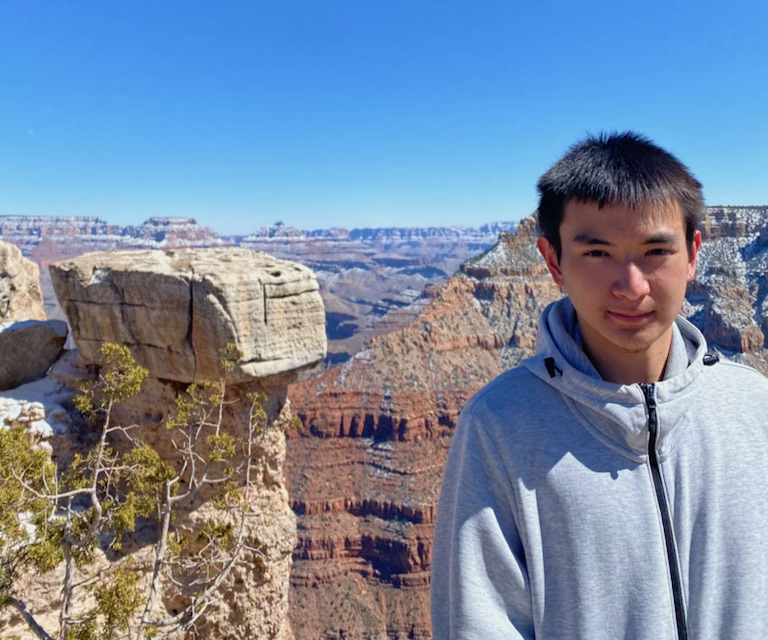

```{r setup, include=FALSE}
knitr::opts_chunk$set(echo = FALSE)
```

## About Me
<div>
```{r, echo=FALSE,out.width="30%", out.height="20%", out.extra='style="float:right; padding: 10px"'}

```
I'm Nuo Wen Lei from Shanghai, studying in the 2026 class of Brown University.

I have an interest in Computer Science, Data Science, and Behavioral Sciences, and I like to play tennis and squash, watch anime, and eat delicious food!
</div>

Ways to reach me:

- [Github](https://github.com/NuoWenLei)
- [LinkedIn](https://www.linkedin.com/in/nuo-wen-lei/)
- Email: nuowen0612@gmail.com
- Instagram: nuowenlei
- Discord: NuoWenLei#0308

Sports:

- Varsity Tennis First Singles in CA. [Here's my tennis video](https://youtu.be/oCPy2Drd_oQ)
- Varsity Squash Number 1 in CA.

## My Journey in High School

Before 2020, my experience with coding had been in various kinds of sandbox environments. Inputs were cleanly defined and outputs bore no real meaning or weight. It was a low point for my interest in programming because nothing I made seemed to make a difference.

In fact, all the projects presented on this website were created after 2020. Because of COVID, our school swiftly adjusted to remote learning, however the quick transition left many teachers under-prepared for the curriculum. There were many long days with little to do at home, so I decided to take up online learning, starting with Harvard's CS50x. That was the spark to my interest in programming.

After completing CS50x rather quickly, I took the web development progression of the course, CS50w. In that class, I learned about both front-end development with HTML, CSS, Javascript and back-end with Flask, Django, and SQL.

I was really excited after gaining this new-found knowledge because I was finally able to write programs that went beyond the sandbox. The first project I created was TakeActionMass in June 2020. Not only was it the culmination of what I had learned in the past 3 months, it also addressed a problem, it sought to make a difference. I'm really proud of it.

During the process of making that website, I encountered various problems with both front-end and back-end. Back-end especially, I had to struggle through a lot of online database problems and understanding its limitations. This struggle actually sparked my interest in the manipulation and organization of data.

In September of 2020, as my Junior year started, I decided to also enroll in University of Michigan's Data Science Specialization with Python on Coursera. It was a 5-course program, covering numerous topics including data processing, visualization, and machine learning models. I learned about various tools in Python that helped a lot with the understanding and processing of data, and also worked through different notebooks each about important problems.

It was also at this time that I started my [investment bot](investment_bot.html) project. Its main purpose is to automatically collect stock market data that I would be able to use in future projects, but I also added a simple investment simulation part just to see how well it can do.

As 2021 came along, I kickstarted my second Data Science specialization on Coursera with IBM, learning more about probability, data processing, and machine learning. As a final project, I wrote the analysis report and created the presentation on [COVID death trends](covid_analysis.html).

It was through these courses that my interest in ML and AI really grew. I began enrolling in extracurricular programs about AI, mainly InspiritAI, and I learned a lot about the concepts and implementation behind AI. By then, it was March, and I created and participated in various projects including: [Epilepsy Detection](epilepsy_webapp.html), [Mask Detection](mask_webapp.html), [Explorantine](explorantine.html), [WangWang](wangwang.html), and [Shanghai Property Analysis](shanghai_property.html).

These laid the groundwork for my further exploration into the field of Data Science and AI during the summer of 2021. I enrolled in a Data Science course and created the [PAC analysis website](pac_analysis.html) as well as contributed to the [R tutorial package](r_package.html).

This is the story of my journey so far. As Senior year and college applications approach, I hope I can still make the time to work on these projects because it has really been a transforming experience.
