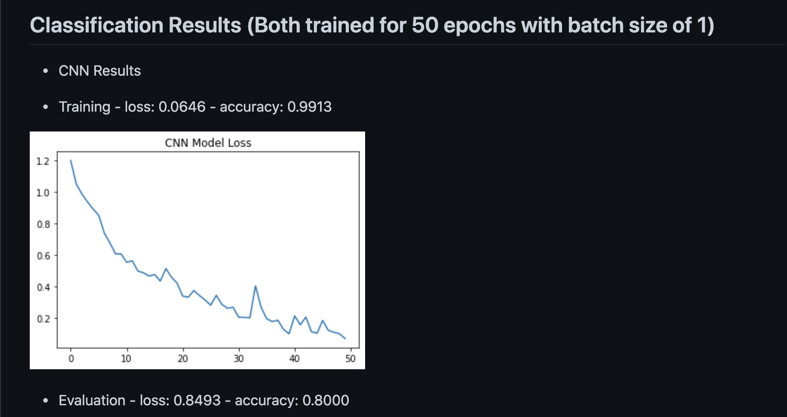

```{r setup, include=FALSE}
library(knitr)
knitr::opts_chunk$set(echo = FALSE)
```

## About the Project

This project started off as my final project for an IBM Data Science MOOC course. I used basic AI methods like Long Short Term Memory (LSTM) models to try to predict COVID death trends.

<iframe width="560" height="315" src="https://www.youtube.com/embed/DyjopF7Bq7Q" title="YouTube video player" frameborder="0" allow="accelerometer; autoplay; clipboard-write; encrypted-media; gyroscope; picture-in-picture" allowfullscreen></iframe>

My [**final presentation**](https://www.youtube.com/watch?v=DyjopF7Bq7Q) is posted on YouTube, and it shows the process I went through to extract and construct the data as well as suggest a basic AI solution.


```{r, fig.cap = "https://github.com/NuoWenLei/covid_tracking_by_state#readme"}

```

However, after the course, I wanted to see if I could create a way that produced better numbers in predicting trends, so I dove deeper into more innovative data-processing methods and documented my full process and results on [**this Github page**](https://github.com/NuoWenLei/covid_tracking_by_state#readme).

