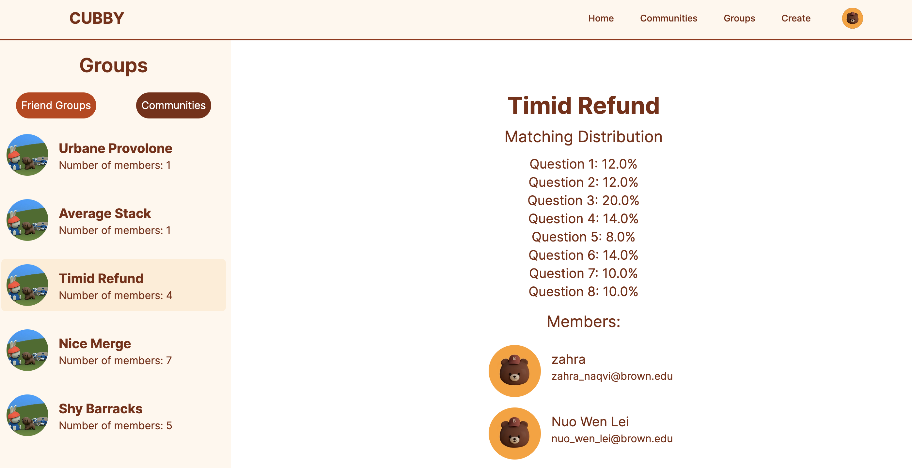

```{r setup, include=FALSE}
library(knitr)
knitr::opts_chunk$set(echo = FALSE)
```

Associated Links:

- [Cubby website](https://cs320-cubby.vercel.app/)
- [Cubby API](https://cubbyapi.com/docs)
- [GitHub](https://github.com/NuoWenLei/cs320-cubby#readme)

This project stemmed from my desire to utilize Machine Learning techniques in a web development project. I wanted to cross my two fields of interest within Computer Science into a project and that's how the idea of Cubby was born!

```{r, fig.cap = "Landing page of Cubby"}

```

The timeframe for this project was very tight due to the limited 3 weeks we had before the end of school but we made it work with an incredible team that had many specialists in various areas.

```{r, fig.cap = "Matching page of Cubby"}

```

The frontend design was made by a teammate who was a senior at Brown that had learned about UI/UX and taken multiple design courses, and therefore she had the experience with 3D rendering and various amazing design choices! While I tried my best to implement her designs, we could not fit in some features like dynamically generated images within the time frame we were given.

```{r, fig.cap = "Cubby FastAPI page"}

```

The backend was made by me using the FastAPI Python package. It utilizes pretrained word embeddings from [GloVe](https://nlp.stanford.edu/projects/glove/) to encode questionnaire answers into embeddings, which allows us to use KMeans clustering to group people together by the semantic similarity of their questionnaire answers. However, in order to add an element of randomness (so the matched groups are not always with the same people), I chose to randomly sample a limited number of dimensions from the encoded vectors to cluster on.

```{r, fig.cap = "Cubby Community page"}

```

We also wanted to give people the option to form their own groups, so we also created a communities page where people can create and join communities. An interesting technical detail is that we implemented the search function to match community names with the query based on Cosine Similarity, which is different from usual search algorithms.

```{r, fig.cap = "Cubby Group page"}

```

In conclusion, this project was a joy to work on and my teammates was very collaborative and timely with their tasks. While I am not sure if we will expand this idea any further, this remains an interesting project that I personally believe has a lot of potential. And it is something that I may revisit someday!

