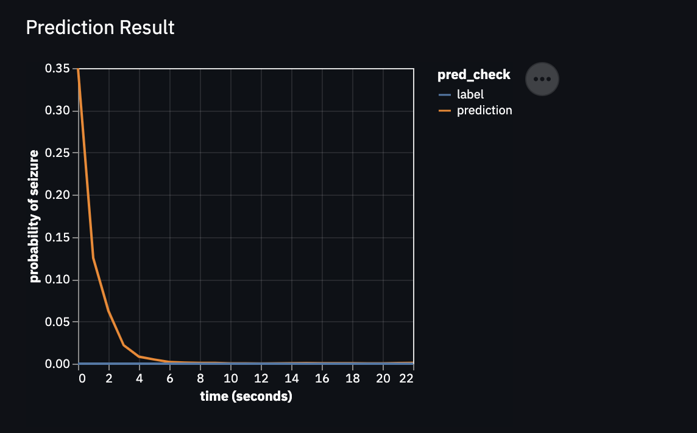

```{r setup, include=FALSE}
library(knitr)
knitr::opts_chunk$set(echo = FALSE)
```

## About the Project

With friends from an online AI course, [Inspirit AI](https://www.inspiritai.com/), we trained an AI to detect if a patient is experiencing epilepsy based on their EEG brain wave graph.

```{r, fig.cap = "Output of AI shows its confidence in its decision while processing the graph"}

```

We were able to reach an accuracy of **89%**, which is definitely not accurate enough to be used professionally. However, throughout the project we learned a lot about the ethical concerns surrounding AI's influence on major fields as well as problems with modern-day AI's explain-ability that discourage people to trust its results.
