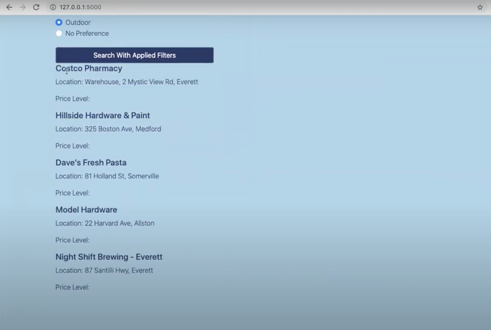

```{r setup, include=FALSE}
library(knitr)
knitr::opts_chunk$set(echo = FALSE)
```

Associated Links:

- [Devpost Project Showcase](https://devpost.com/software/explorantine-nhezvm)
- [Github Repo](https://github.com/CaspianA1/BBN-Hackathon)
- [Online Presentation of Hackathon Project](https://youtu.be/ALz4xrCCu2M)

Joined by friends from Concord Academy and Middlesex, our team of 4 took on a one-day hackathon of creating a proof-of-concept web project.

My teammates were:
[Shreya Jain](https://github.com/shreyaj1212)
[Caspian Ahlberg](https://github.com/CaspianA1)
[Rachel Hu](https://github.com/025rhu)

One of the awards was "Best Small Business Solution", which was the award we were aiming for. Since small businesses were losing a lot of customers during the pandemic, we decided to make a web app centered around supporting local businesses. It allowed users to search for nearby businesses based on their mood or desired activities.

```{r, fig.cap = "Main Page of Explorantine"}
knitr::include_graphics("static/pictures/explorantine-main-page.png")
```

The page returns a list of places that are near your location. However, since this is a proof of concept, there are a lot of rough edges and room for improvement with the results.

```{r, fig.cap = "Main Page of Explorantine"}

```

Using Natural Language Processing techniques with NLTK and spaCy as well as the Google Places API, we were able to match moods based on user input and search for places nearby that fit the user's desire. It was the combination of a lot moving parts but with 10 hours straight of working on it, we got it working.

<iframe width="560" height="315" src="https://www.youtube.com/embed/ALz4xrCCu2M" title="YouTube video player" frameborder="0" allow="accelerometer; autoplay; clipboard-write; encrypted-media; gyroscope; picture-in-picture" allowfullscreen></iframe>

In the end, we were able to not only win "Best Small Business Solution" but also "Best Overall"! It was extremely fun to work on this project with friends, and if the opportunity presents itself in the future, I'd gladly refine and hopefully publish this project to the world!


