```{r setup, include=FALSE}
library(knitr)
knitr::opts_chunk$set(echo = FALSE)

# Learn more about creating websites with Distill at:
# https://rstudio.github.io/distill/website.html

# Learn more about publishing to GitHub Pages at:
# https://rstudio.github.io/distill/publish_website.html#github-pages

```

## About
<div>
```{r, echo=FALSE,out.width="30%", out.height="20%", out.extra='style="float:right; padding: 10px"'}
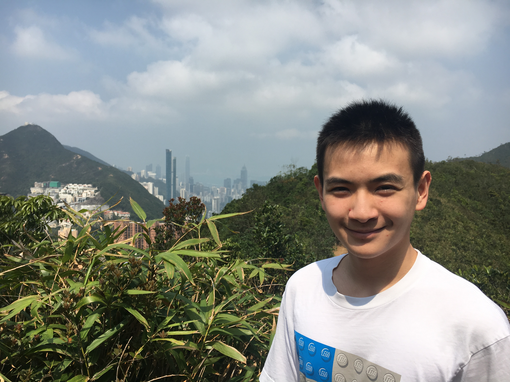
```
Hello, I'm Nuo Wen Lei from Shanghai, current studying at Brown University, class of 2026. My personal interests mainly lie in the realm of understanding humanities and the world around me through the lens of data and logic.
<br><br>
I'm also a tennis and squash player ([clip of me playing tennis](https://youtu.be/oCPy2Drd_oQ)) as well as a Japanese-cuisine appreciator with ramen and chicken wings being my favorite.
<br><br>
This website is a gallery of the projects I've done. It shows how my interests developed over time from computer science to web design to data science and AI.
<br><br>
I hope you find something interesting or just enjoy your time on this website!
</div>

## Table of Contents
- [COVID Death Trend Analysis and AI Prediction](covid_analysis.html)
- [Cubby - Friend Data Matcher](cubby.html)
- [Epilepsy Detection AI Web App](epilepsy_webapp.html)
- [Hackathon Winning Project - Explorantine](explorantine.html)
- [Investment Bot](investment_bot.html)
- [Mask Detection AI Web App](mask_webapp.html)
- [PAC Donation Analysis Website](pac_analysis.html)
- [R Tutorial Package Contribution](r_package.html)
- [Senior Project - Neural Network Interpreter](senior_project.html)
- [Shanghai Property Analysis Website](shanghai_property.html)
- [WeChat Miniprogram - WangWang](wangwang.html)
- [Wordle and Quordle Solver](wordle.html)


## Quick Overview
### Go to Projects tab for more details on each individual project

<div id = "covid_analysis">
```{r, echo=FALSE,out.width="49%", out.height="20%", out.extra='style="float:left; padding: 10px"'}
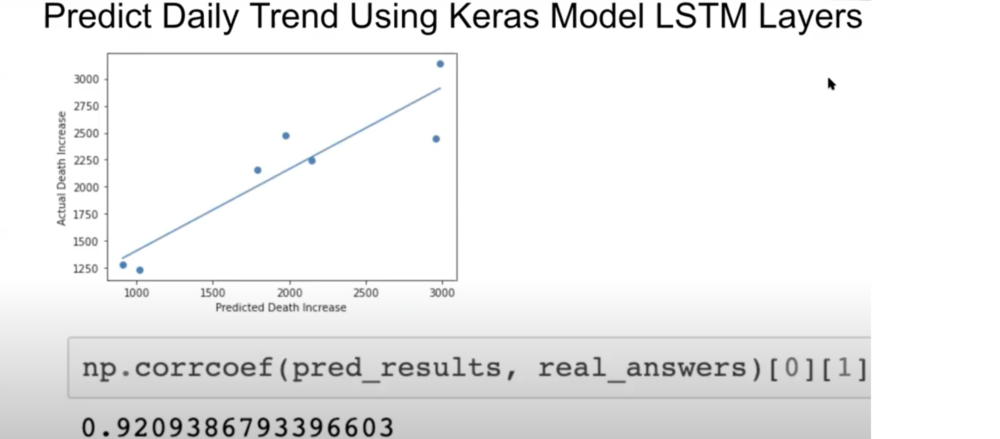
```
[**COVID Death Trend Analysis and AI Prediction**](covid_analysis.html) <br> After an initial analysis of the COVID death trends and trial of basic AI methods, I dive deeper into finding other AI techniques to predict the death trends.
</div>

<div>
<hr>
</div>

<div id = "epilepsy_webapp">
```{r, echo=FALSE,out.width="49%", out.height="20%", out.extra='style="float:right; padding: 10px"'}
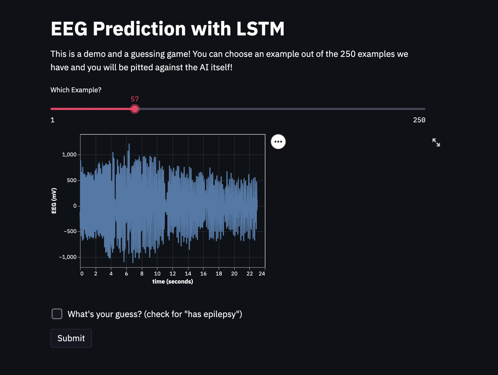
```
[**Epilepsy Detection AI Web App**](epilepsy_webapp.html) <br> I hosted an AI I created with friends that determines if someone is experiencing epilepsy based on EEG brain waves.
</div>

<div>
<hr>
</div>

<div id = "explorantine">
```{r, echo=FALSE,out.width="49%", out.height="20%", out.extra='style="float:left; padding: 10px"'}
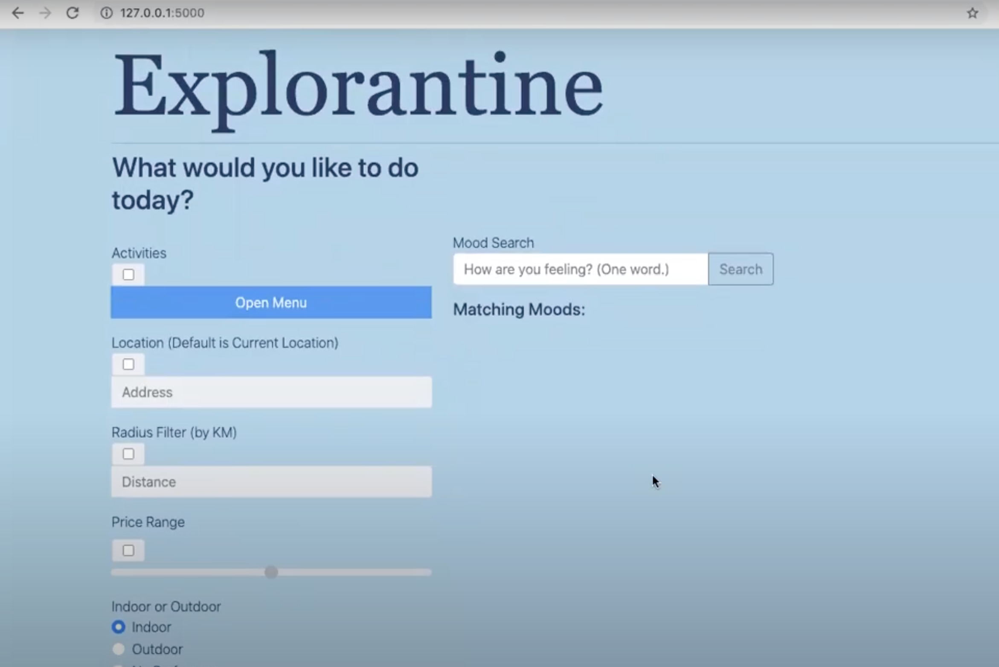
```
[**Hackathon Winning Project - Explorantine**](explorantine.html) <br> Our Hackathon team created a web app to help local businesses bring in customers.
</div>

<div>
<hr>
</div>

<div id = "investment_bot">
```{r, echo=FALSE,out.width="49%", out.height="20%", out.extra='style="float:right; padding: 10px"'}
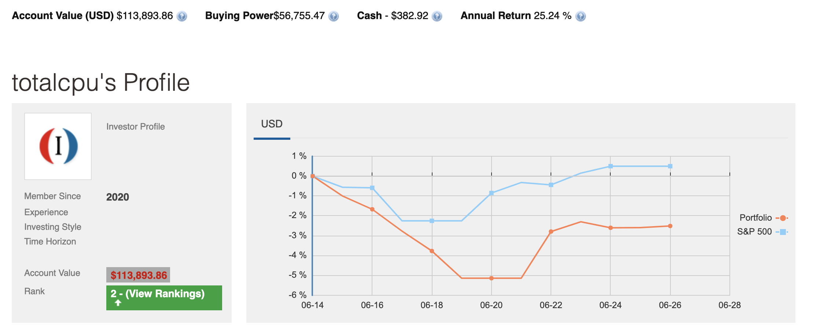
```
[**Investment Bot**](investment_bot.html) <br> I created a pipeline that analyzes web data and invests on an Investopedia simulator.
</div>

<div>
<hr>
</div>

<div id = "mask_webapp">
```{r, echo=FALSE,out.width="49%", out.height="20%", out.extra='style="float:left; padding: 10px"'}
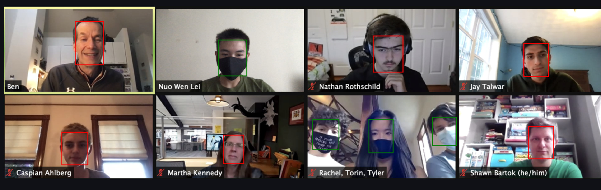
```
[**Mask Detection AI Web App**](mask_webapp.html) <br> I created and hosted an AI on the internet that detects if people are wearing masks in an image.
</div>

<div>
<hr>
</div>

<div id = "pac_analysis">
```{r, echo=FALSE,out.width="49%", out.height="20%", out.extra='style="float:right; padding: 10px"'}
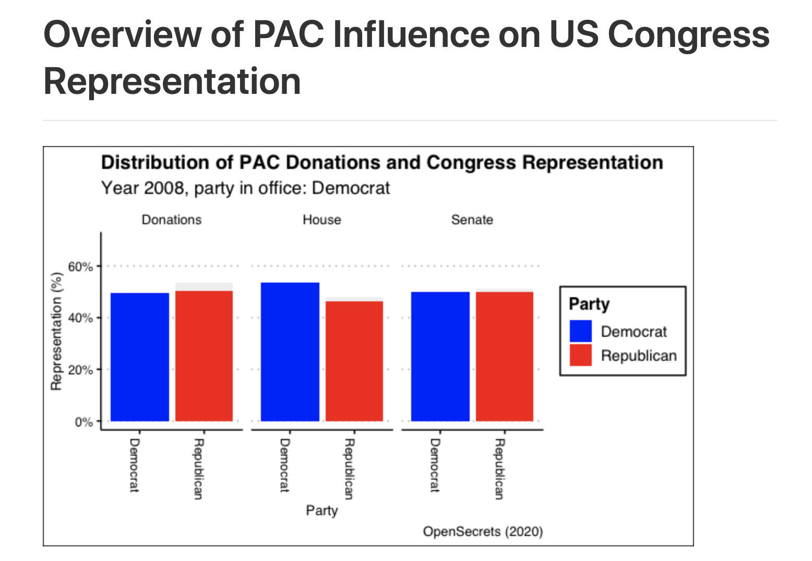
```
[**PAC Donation Analysis Website**](pac_analysis.html) <br> I analyzed and visualized the relationship between foreign-connected company donations with US Congress representation.
</div>

<div>
<hr>
</div>

<div id = "r_package">
```{r, echo=FALSE,out.width="49%", out.height="20%", out.extra='style="float:left; padding: 10px"'}
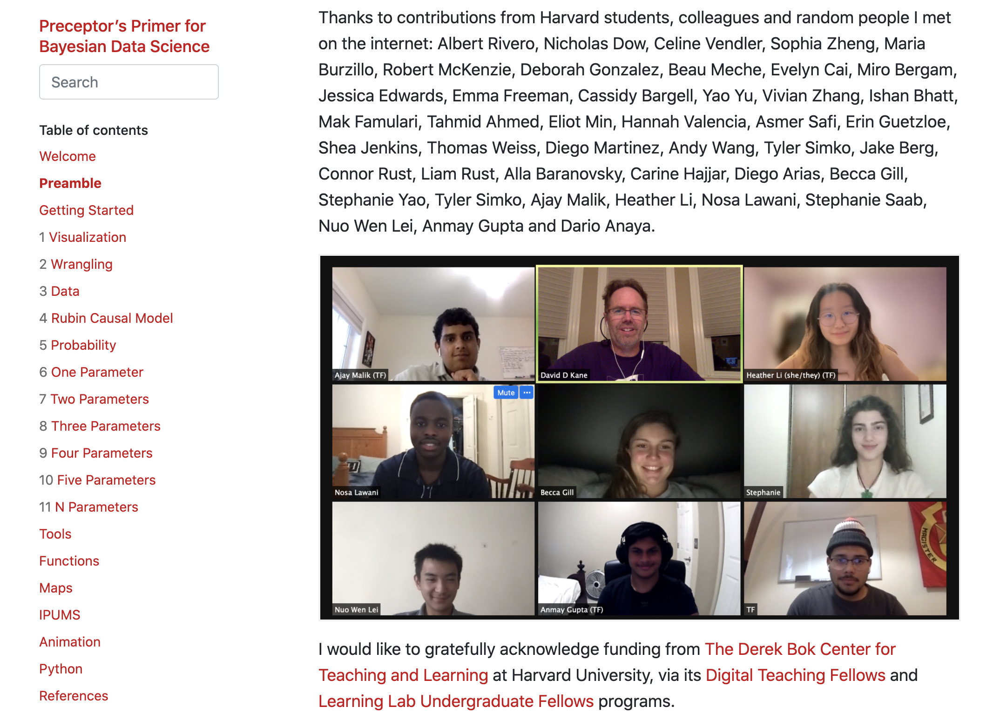
```
[**R Tutorial Package Contribution**](r_package.html) <br> Over the summer of 2021, I work with a professor to help improve an R tutorial package.
</div>

<div>
<hr>
</div>

<div id = "senior_project">
```{r, echo=FALSE, out.width="49%", out.height="20%", out.extra='style="float:right; padding: 10px;"'}
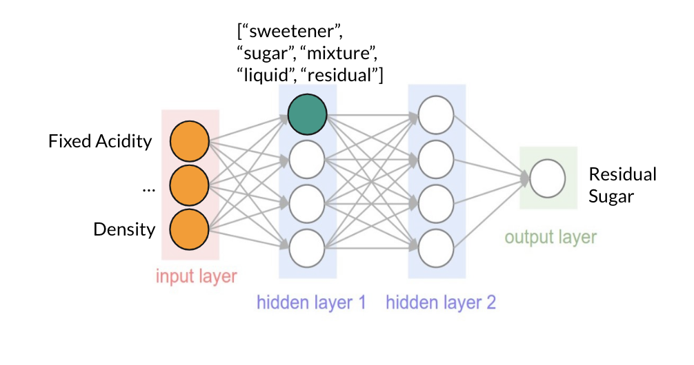
```
[**Senior Project - Model Interpreter**](senior_project.html) <br> For my final spring semester in high school, I aimed to create a neural network interpreter as my senior project.
</div>

<div>
<hr>
</div>

<div id = "shanghai_property">
```{r, echo=FALSE,out.width="49%", out.height="20%", out.extra='style="float:left; padding: 10px"'}
knitr::include_graphics("static/pictures/shanghai-property.png")
```
[**Shanghai Property Analysis Website**](shanghai_property.html) <br> I created a website that visualizes the relationship between properties and position in Shanghai.
</div>

<div>
<hr>
</div>

<div id = "wangwang">
```{r, echo=FALSE, out.width="49%", out.height="20%", out.extra='style="float:right; padding: 10px;"'}
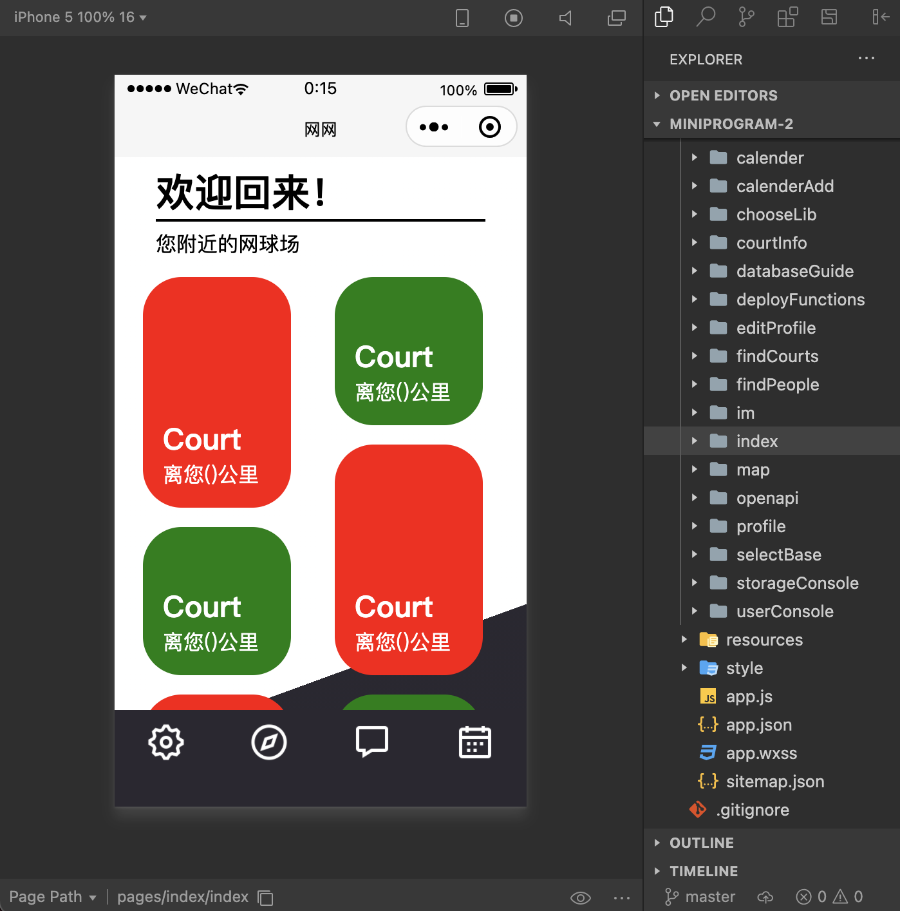
```
[**WeChat Miniprogram - WangWang**](wangwang.html) <br> With friends, we are creating a WeChat miniprogram accessible to all WeChat users that can match tennis players with others who play in the same area.
</div>

<div>
<hr>
</div>

<div id = "wordle">
```{r, echo=FALSE, out.width="49%", out.height="20%", out.extra='style="float:left; padding: 10px;"'}
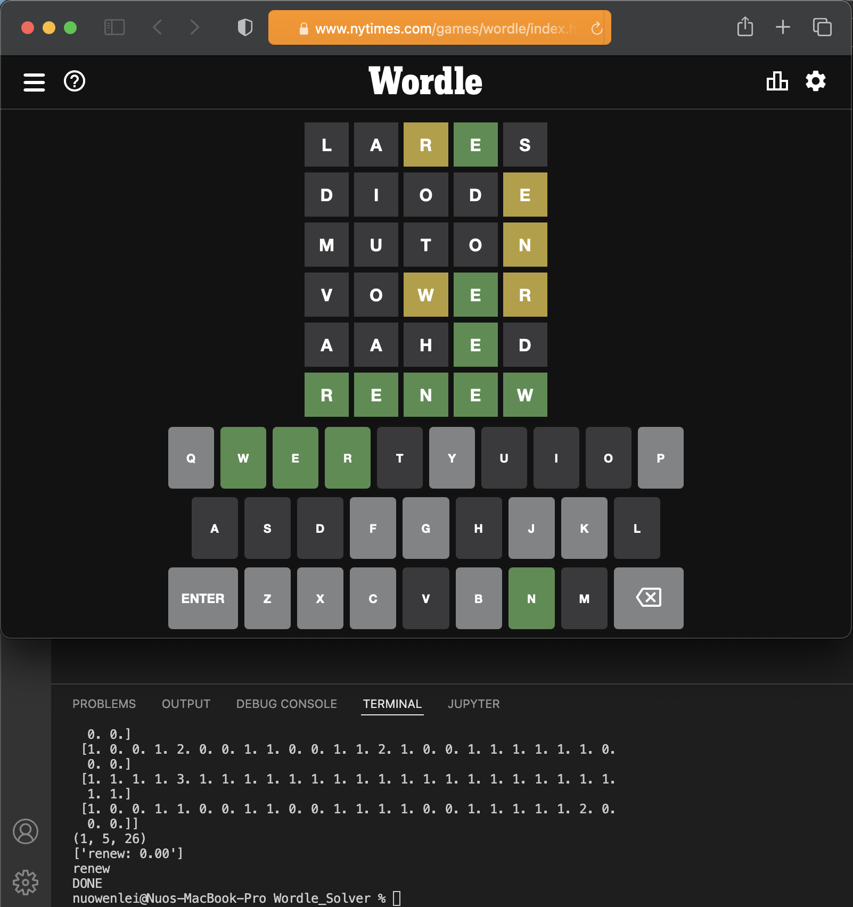
```
[**Wordle and Quordle AND OCTORDLE Solver**](wordle.html) <br> As a fun spring break project, I created an algorithm that can live solve Wordle, Quordle, and Octordle with probability.
</div>

<div>
<hr>
</div>

<div id = "cubby">
```{r, echo=FALSE, out.width="49%", out.height="20%", out.extra='style="float:right; padding: 10px;"'}

```
[**Cubby**](cubby.html) <br> As part of my software engineering class (CS0320), my team created a data matching website that matches people into friend groups based on similarities in questionnaire answers.
</div>


