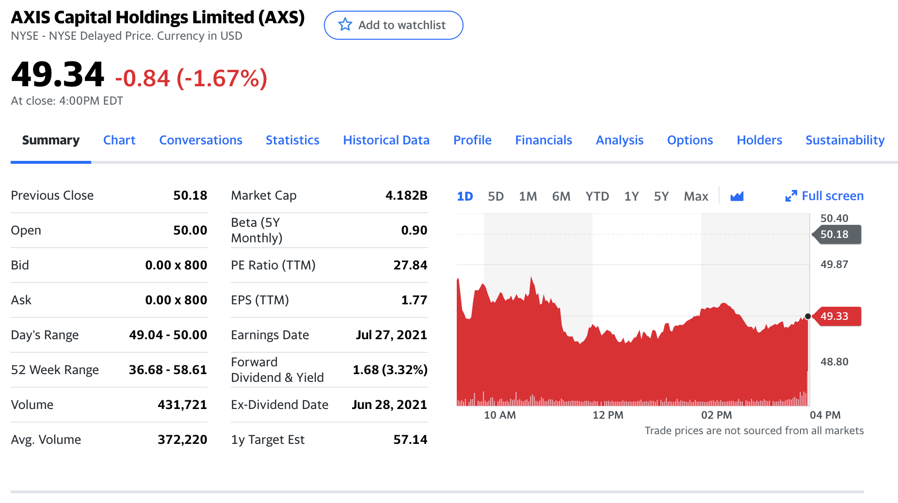
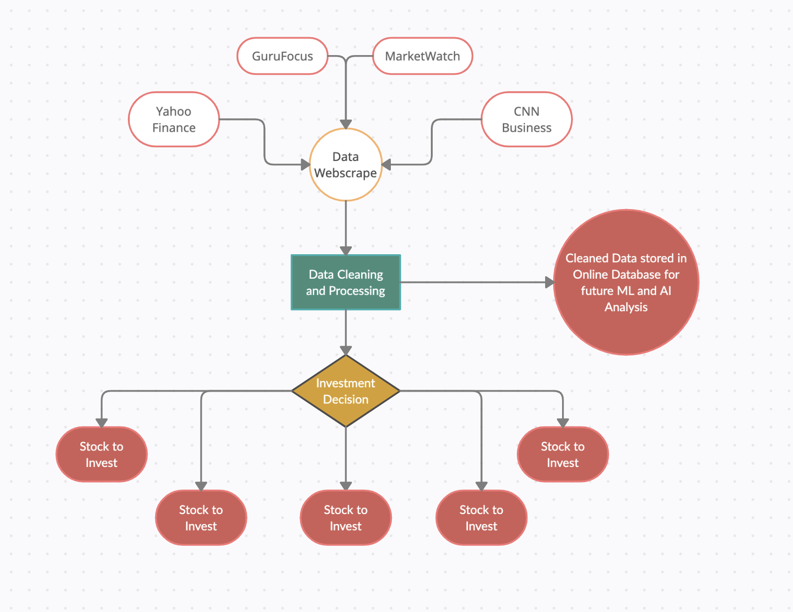

```{r setup, include=FALSE}
library(knitr)
knitr::opts_chunk$set(echo = FALSE)
```

This project started off as a personal challenge. During 2020, I took a lot of online courses through sites like EdX and Coursera ranging from web development to data science.

I've made websites at this point, but I've never really applied my study in data science. This was essentially my first data science project.

```{r, fig.cap = "Yahoo Finance page for the stock AXS"}

```

Using python and its various libraries, I created a simple pipeline to extract and analyze online data and then invest based on its results. Then I attached this pipeline to a web server that will run this pipeline every week.

```{r, fig.cap = "Visualization of investment pipeline"}

```

**Data Webscrape** - The pipeline starts by taking various numerical and textual data from multiple online sources.

**Data Cleaning and Processing** - The data is then cleaned for processing use since these online sources meant for the data to be presented to people and not machines. In this section, features like market cap values are also created based on their non-numeric displays on websites.

**Investment Decision** - Based on the data collected, each feature is assigned a weightage in the decision-making process, allowing each stock to be "scored". Then the pipeline invests in the 5 highest-scoring stocks on an Investopedia simulator.

The next step for this project is to integrate an ML or AI model into the pipeline, so that the pipeline can essentially learn and improve over time.


