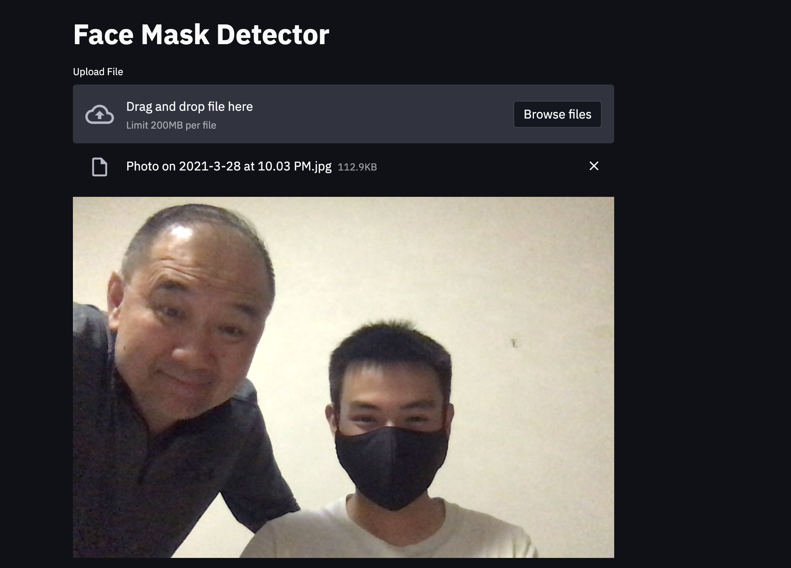
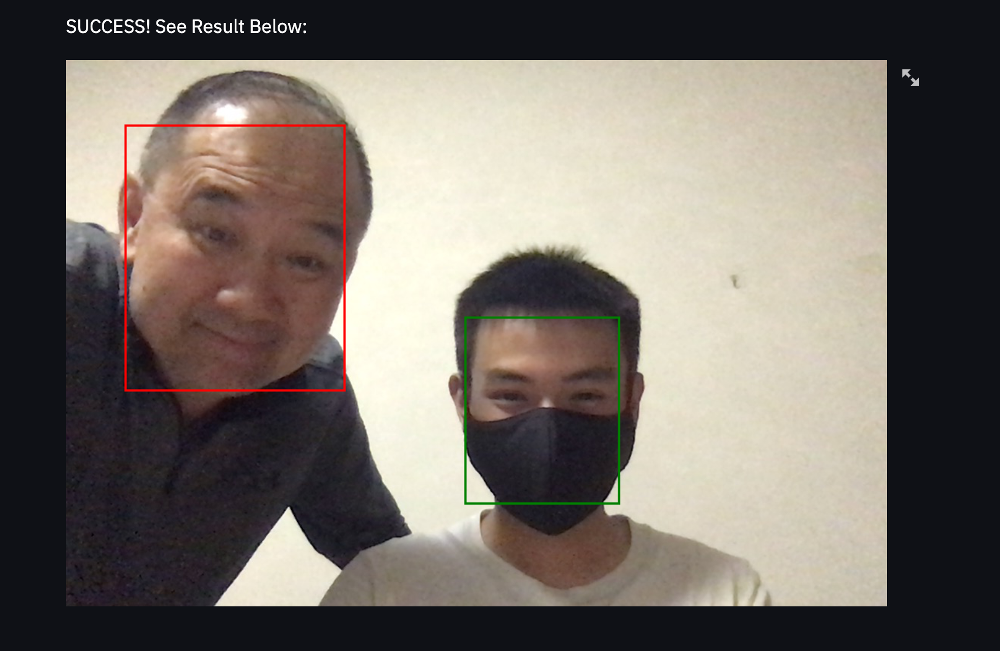

```{r setup, include=FALSE}
library(knitr)
knitr::opts_chunk$set(echo = FALSE)
```

Associated Links:

- [Mask Detection Web App](https://mask-detector-web.herokuapp.com/)
- [Image-processing AI Concept Presentation](https://youtu.be/0rtiLMUj2ZM)

By combining a face detection model and my personal mask detection model, I created an AI that can individually detect for each person in a photo if they are wearing a mask.

```{r, fig.cap = "Preview of uploaded image before processing"}

```

I then hosted this AI on a website for people to try out for themselves. I also presented this project as a demo for a [presentation about teaching AI concepts](https://youtu.be/0rtiLMUj2ZM) to CA's robotics club members.

Feel free to try this AI out for yourself [**here**](https://mask-detector-web.herokuapp.com/). Note that it does take a while to load because the AI model size is big.

```{r, fig.cap = "Result after mask detection AI processed image"}

```


