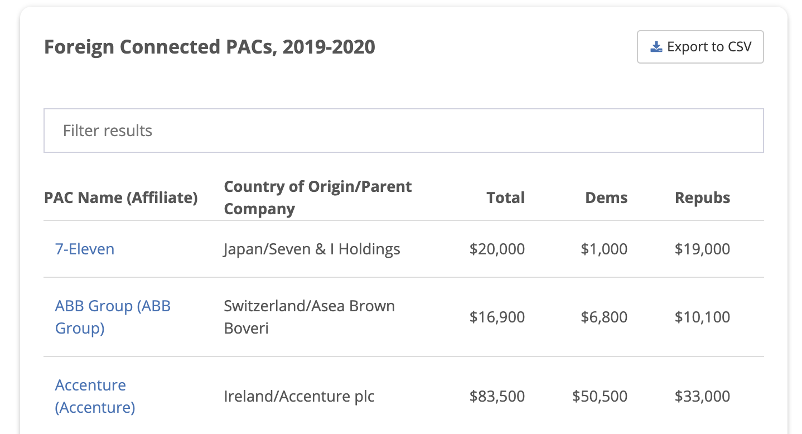

```{r setup, include=FALSE}
library(knitr)
knitr::opts_chunk$set(echo = FALSE)
```

For the final project of a data science course about R, I picked my own topic of research to be about foreign-connected Political Action Committee donations for US political parties.

Please feel free to [**visit the project page**](https://nuowenlei.github.io/pac-influence/) and see for yourself.

```{r, fig.cap = "Data source for the project"}

```

In the project, I scrape data from [OpenSecrets](https://www.opensecrets.org/) and process it to produce visualizations comparing donation amounts and Congress representations between 2000 and 2020.
