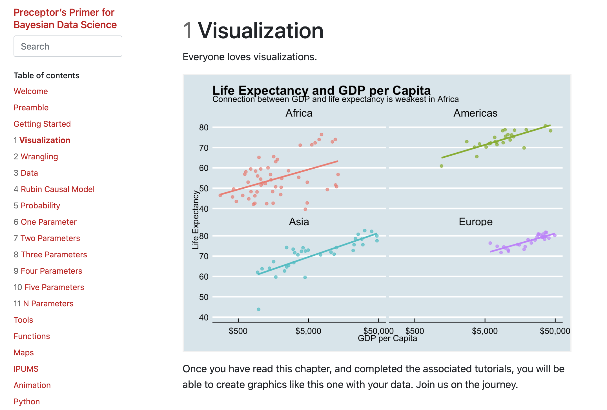
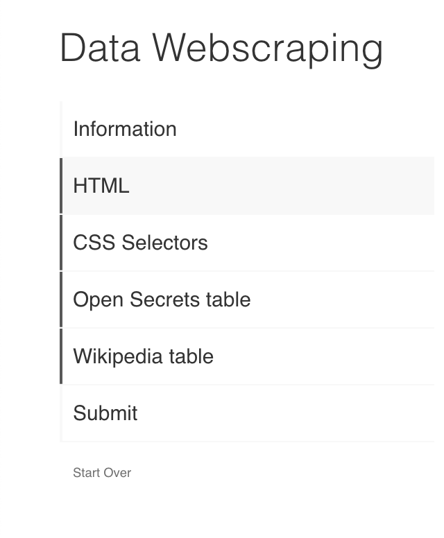
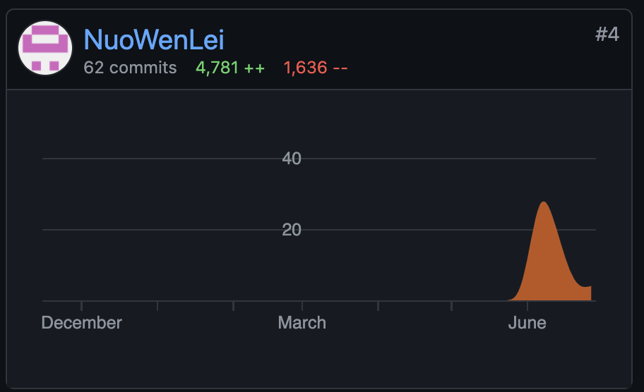
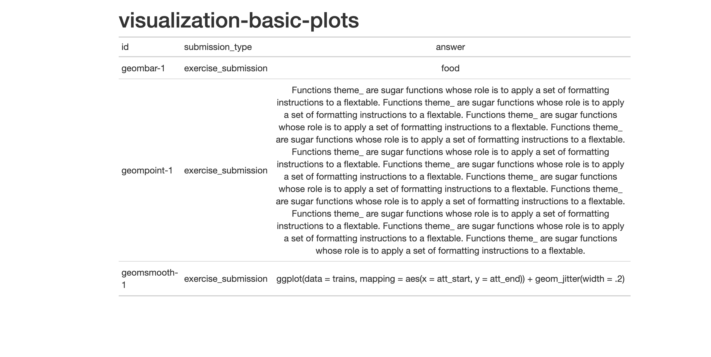

```{r setup, include=FALSE}
library(knitr)
knitr::opts_chunk$set(echo = FALSE)
```

Associated Links:

- [Preceptor's Primer for Bayesian Data Science](https://ppbds.github.io/primer/index.html)
- [Data Science Course hosted by professor David Kane](https://bootcamp.davidkane.info/)

At the end of the 2021 school year, I joined a [free data science course hosted by professor David Kane](https://bootcamp.davidkane.info/). During which, he reached out to me to ask if I'd like to work with him over the summer to help improve his R tutorial package, [Preceptor's Primer for Bayesian Data Science](https://ppbds.github.io/primer/index.html).

```{r, fig.cap = "Chapter 1 of the Primer"}

```

I gladly joined him with a few other volunteers. I started off by just catching and editing small mistakes in the tutorials reported by users, then I got the opportunity to write the tutorial, Data Webscraping, myself. And afterwards, I was allowed to make some larger changes to tutorials in general.

```{r, fig.cap = "Side navigation bar of the Data Webscraping tutorial"}

```

First, I was assigned to add some quality-of-life features for better user experience. Then I helped make the process of creating tutorials more streamlined and simple by adding pre-defined templates and keyboard shortcuts to take the tedious work of writing each exercise individually off the tutorial-makers.

```{r, fig.cap = "My Github contributions to the package"}

```

Afterwards, I worked on fixing a lot of the package's technical errors while adding more addins that check and format tutorials. Also, a recent feature I am working on is creating a report of submitted answers for users to look at after completing each tutorial.

```{r, fig.cap = "Sample Report"}

```

I plan on working on this package for the entirety of the summer, so I hope I can create more useful and interesting features in the next month!


