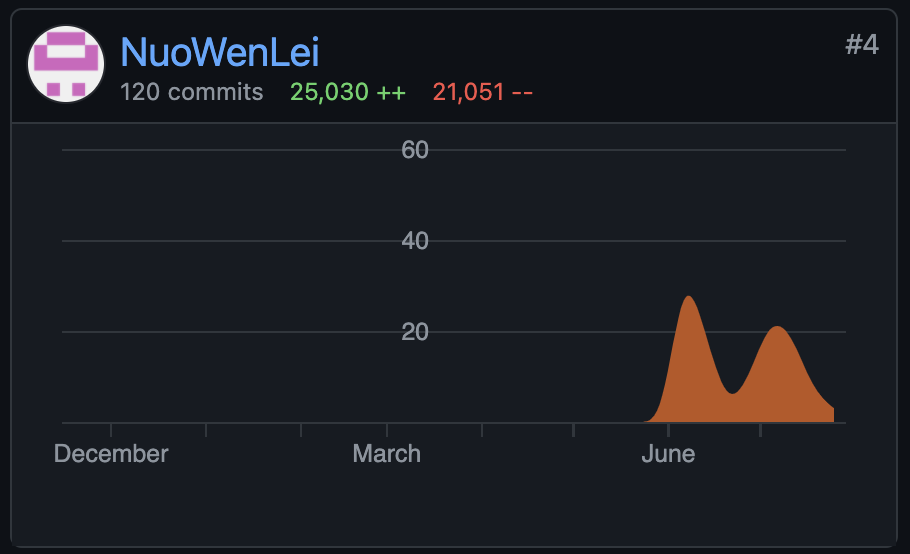
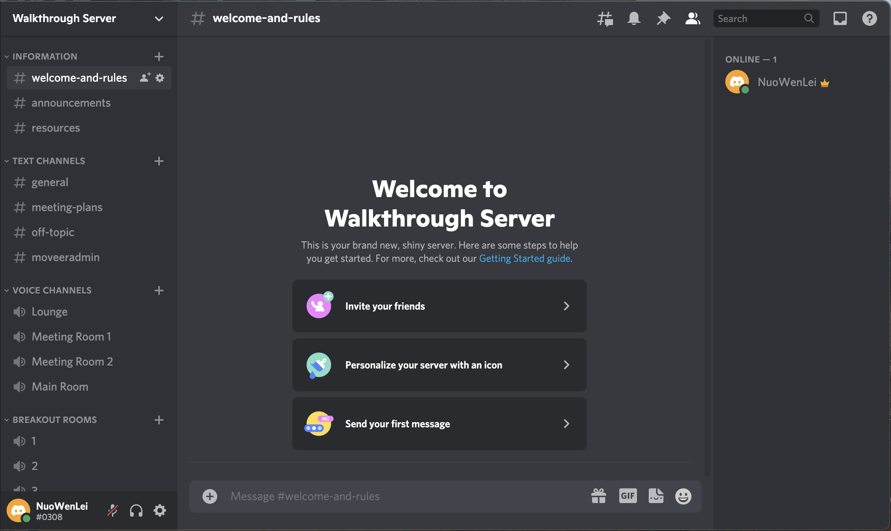

```{r setup, include=FALSE}
library(knitr)
knitr::opts_chunk$set(echo = FALSE)
```

Associated Links:

- [Preceptor's Primer for Bayesian Data Science](https://ppbds.github.io/primer/index.html)
- [Data Science Course hosted by professor David Kane](https://bootcamp.davidkane.info/)
- [Class Management Documentation](https://ppbds.github.io/primer.tutorials/articles/class_management.html)
- [Assignment Management Documentation](https://ppbds.github.io/primer.tutorials/articles/assignment_management.html)
- [All my code contributions](https://ppbds.github.io/primer.tutorials/reference/index.html)

At the end of the 2021 school year, I joined a [free data science course hosted by professor David Kane](https://bootcamp.davidkane.info/). During which he reached out to me to ask if I'd like to work with him over the summer to help improve his R tutorial package, [Preceptor's Primer for Bayesian Data Science](https://ppbds.github.io/primer/index.html).

```{r, fig.cap = "Chapter 1 of the Primer"}
knitr::include_graphics("static/pictures/ppbds-1.png")
```

I gladly joined him with a few other volunteers. I started off by just catching and editing small mistakes in the tutorials reported by users, then I got the opportunity to write the tutorial, Data Webscraping, myself. And afterwards, I was allowed to make some larger changes to tutorials in general.

```{r, fig.cap = "Side navigation bar of the Data Webscraping tutorial"}

```

First, I was assigned to add some quality-of-life features for better user experience. Then I helped make the process of creating tutorials more streamlined and simple by adding pre-defined templates and keyboard shortcuts to take the tedious work of writing each exercise individually off the tutorial-makers.

```{r, fig.cap = "My Github contributions to the package"}

```

Afterwards, I worked on fixing a lot of the package's technical errors while adding more addins that check and format tutorials. Also, a recent feature I am working on is creating a report of submitted answers for users to look at after completing each tutorial.

```{r, fig.cap = "Sample Report"}
knitr::include_graphics("static/pictures/ppbds-report.png")
```

As the summer came to an end, I shifted towards working more on general class and assignment management programs. With Discord templates and bots, I built a [class system](https://ppbds.github.io/primer.tutorials/articles/class_management.html) that allowed classes to be organized and conducted over Discord in a similar fashion as over Zoom.

```{r, fig.cap = "Class Discord Server Template"}

```

And the final assignment management features I added were what I thought to be my greatest contributions to the package. Using R packages that allowed remote and automated access to Gmail and Google Drive, I created an [assignment collection, organization, and summarization system ](https://ppbds.github.io/primer.tutorials/articles/assignment_management.html). With a single function, my code was able to collect the submissions from someone's Gmail, downloaded them, and aggregate user information such as name, email, and time spent. After processing the submissions, the aggregated data and submissions are uploaded to their Google Drive, allowing for easy access to the tallied information.

```{r, fig.cap = "Class Discord Server Template"}

```

It was truly an amazing experience to work so closely with professor David Kane over the summer. If there is ever another chance for me to do meaningful work with him, I would gladly do so!


