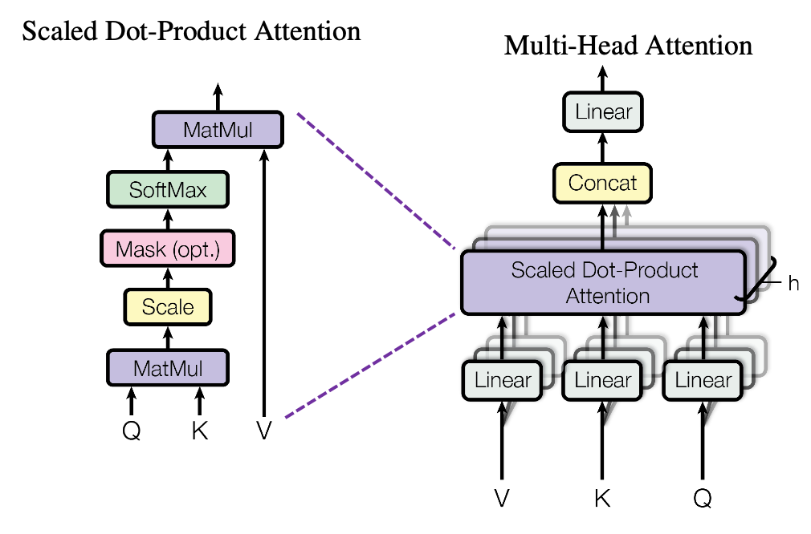

```{r setup, include=FALSE}
library(knitr)
knitr::opts_chunk$set(echo = FALSE)
```

Associated Links:

- [GitHub Repo](https://github.com/NuoWenLei/senior_project_stuff)
- [School Presentation](https://docs.google.com/presentation/d/1HTauzC1eWBQXbKCHm5CnlEnE7BqevxECg2qkCQ1kEVA/edit?usp=sharing)
- [OPTIMIZATION AS A MODEL FOR FEW-SHOT LEARNING](https://openreview.net/pdf?id=rJY0-Kcll)
- [ATTENTION IS ALL YOU NEED](https://arxiv.org/pdf/1706.03762.pdf)

This is the senior project that I dedicated most of my spring semester to. The focus is on creating a proof-of-concept AI model that can interpret another AI model. Using word embeddings to understand features and weights and biases between layers to understand relationships between data points and neurons, I wanted to make an AI model that can "translate" the AI neuron weights to english, cracking open the neural network blackbox.

```{r, fig.cap = "Interpreter Pipeline Structure"}

```

The way I landed on this particular idea was kind of through a mishmash of what I wanted to try and what problem I wanted to solve (mostly just what I wanted to try). I have always wanted to try making models that processed and produced the weirdest inputs and outputs. It just seems like when building models that processed images or sequences, I just slap on some CNNs or LSTMs and then call it a day, rarely contributing anything of my own. Therefore, building this interpreter model is in a way like a challenge for myself. However, that is not to say there is no application for a model like this.

```{r, fig.cap = "Difference in model interpretability between Logistic Regression (ML) and Neural Network (DL)"}

```

The image above compares the difference in model complexity and therefore interpretability between a logistic regression model and a neural network model. You can see that for logistic regression or any kind of direct regression model for that matter, each input feature is assign a single weightage, representing how that feature contributes to the output.

However look to the right and you'll see that it's not as straightforward for the neural network. If every line (edge) represents a weightage, you'll see that the neural network has quite a few more weightages than the logistic regression model. This is largely due to the hidden layers between the inputs and output. These hidden layers contain their own neurons whose meanings are defined and refined by the model. Therefore, encoded as numbers that only the model that created it can understand, neural networks become like blackboxes, incomprehensible to humans.

This interpretability issue actually does impact company decisions to utilize and "trust" these machines because often times, especially in recent years, the question of equity has been raised to many big data models. Companies need to make sure that their models do not treat demographics unequitably, and so clarity within the model is very important. The neural network's lack in that area thus often push big data companies away from using deep learning solutions and resorting to more basic machine learning solutions that produce decent results with clarity of feature importance.

This is the problem I wanted to solve with this model, some kind of mediator that can tell humans what the models are thinking.

```{r, fig.cap = "Word Embedding Visualization"}

```

So to make my model understand words, I encoded all the feature names into word embeddings, which are vector points that represent word relationships within a 300-dimensional vector space. To let my model understand word embeddings, I utilized the Multi Head Attention layer proposed in the paper, [ATTENTION IS ALL YOU NEED](https://arxiv.org/pdf/1706.03762.pdf) and performed self attention with the layer. This allows the model to mix and understand how every dimension of the word embedding vectors relate to each other, thereby letting the model gain an even more comprehensible understanding of the features.

```{r, fig.cap = "Multi Head Attention layer structure"}

```

By combining the understanding of words and linear weights, I created 2 model types based on the mutability of input order. When thinking about how to input the data, I realized that the model shouldn't need to have an immutable input order, as in an arbitrary feature "x" shouldn't always have to be in the same position of the batch. Therefore I first created a model structure that didn't need a determined input order by treating one data sample with all the different features and weights as a batch with each sample being the corresponding feature and weight.

```{r, fig.cap = "Interpreter with dynamic input order"}

```

Then, to see if an interpreter that assumes static input order yields any benefits, I created a static version too. This static version also takes into account a covariance matrix between features and feature weights since it can assume static input order. The point of the matrix is that it should allow the interpreter to get a ballpark of where the output feature should be in word embedding vector space. 

```{r, fig.cap = "Interpreter with static input order"}

```

In terms of results, the static interpreter succeeded in training, continuing to improve even after some 250 steps while the dynamic interpreter seems to have plateaued just after some 50 steps of training.

```{r, fig.cap = "Training results of the two interpreters"}

```

However, after actually putting the interpreters into a testing environment, the results qualitatively changed drastically.

```{r, fig.cap = "Prediction results of the two interpreters"}

```

Both were given a base model that uses many attributes of a wine to predict the residual sugar in the wine. While the static interpreter repeatedly predicted words that had little to no relation with "residual sugar", the dynamic interpreter has predicted words that are similar to, if not exactly, "residual sugar". I think the difference in training and prediction environment results is a testament to how overfitting can be such a misleading problem.

Anyways, to conclude, this was a super fun project, guiding myself through everything. I feel like that proof-of-concept stage has been reached through this project. And while there are many ways to further this project, I don't think I am skilled enough to pursue many of those options. So I'll put the further exploration of this project on hold and see if I can tackle it any better when I return to it.

If you want to see my presentation for this project, you can [click here](https://docs.google.com/presentation/d/1HTauzC1eWBQXbKCHm5CnlEnE7BqevxECg2qkCQ1kEVA/edit?usp=sharing).

And here is the [GitHub repo](https://github.com/NuoWenLei/senior_project_stuff) with code for the project.

