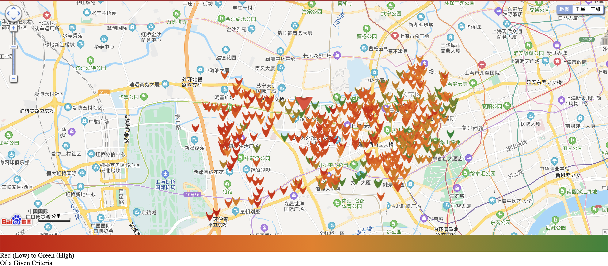
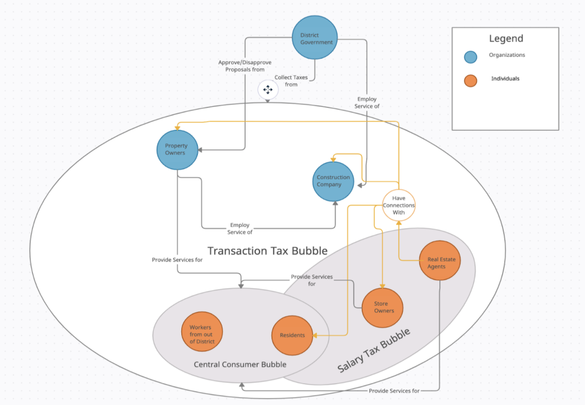

```{r setup, include=FALSE}
library(knitr)
knitr::opts_chunk$set(echo = FALSE)
```

Associated Links:

- [Shanghai Property Analysis Project Page](https://nuowenlei.github.io/mapping-bingo-surround/index/index.html)


As part of a school course about urban planning, I decided to analyze the surrounding area of where I lived. It first started off as a small area analysis, but as my interest grew into Shanghai's urban planning and as my direction of research became clearer, I scraped data from online property-selling sites to produce a map that visualizes different attributes of properties and their positions in Shanghai.

```{r, fig.cap = "Distribution of district property colored by **year of construction** (red: old, green: new)"}
knitr::include_graphics("static/pictures/shanghai-property.png")
```

Users can choose what attribute of the property to visualize and gain an insightful overview of the city distribution.

```{r, fig.cap = "Distribution of district property colored by **average price per square meter** (red: low, green: high)"}

```

With this map, I also considered stakeholders and their interconnectivity in this area.

```{r, fig.cap = "Graph of profit relationships between stakeholders in the Shanghai community"}

```

Overall, I'd say this project in the scope of my school course was a success. Through this experience, I've learned that the world of urban planning is vast. This project has only glimpsed at the peak of the iceberg and if opportunities arise in the future for me to dive deeper into the hidden effects and influences of urban planning, I'd gladly pursue it!
