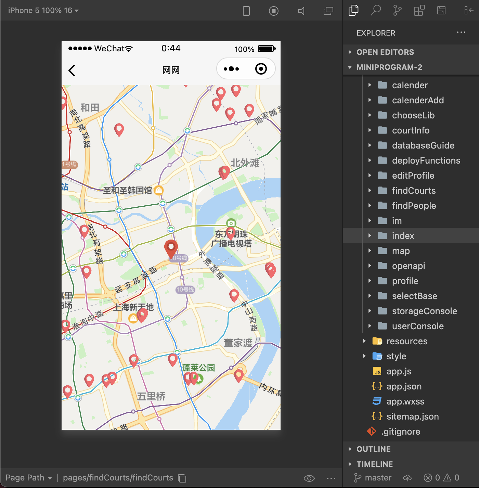
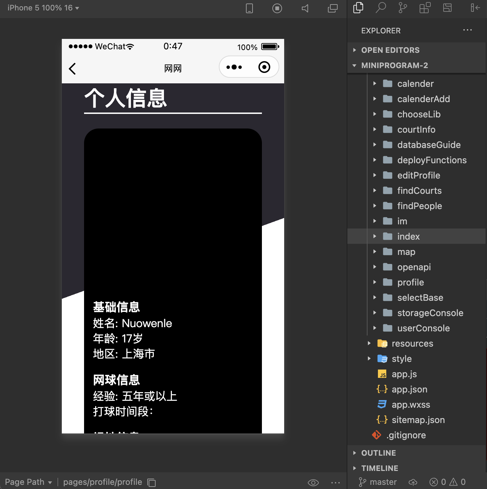
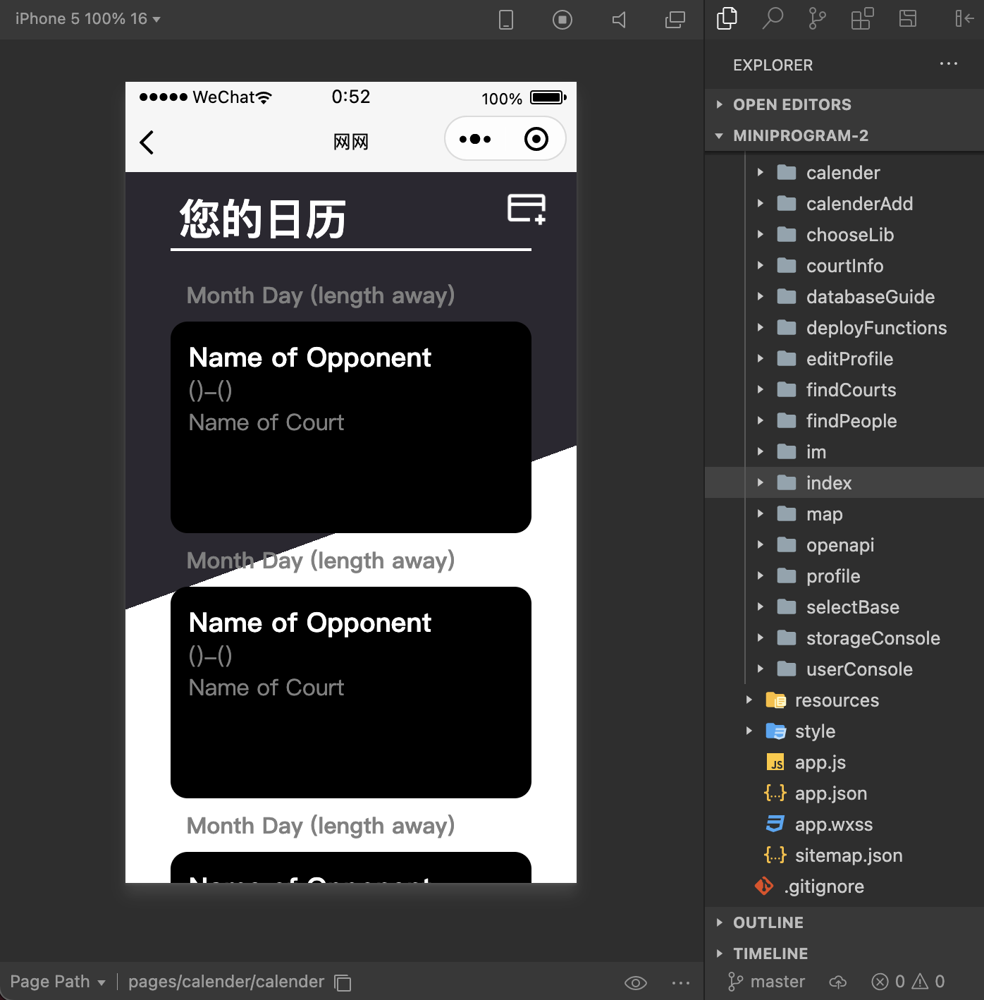

```{r setup, include=FALSE}
library(knitr)
knitr::opts_chunk$set(echo = FALSE)
```

A good friend and I started this project because we were both tennis players who had a hard time finding new players to play with near us. Therefore, we decided to make a WeChat miniprogram that does exactly that. We decided to create it as a WeChat miniprogram to reach a large audience because WeChat is the main way of communication in China.

```{r, fig.cap = "Main Page of WangWang"}
knitr::include_graphics("static/pictures/wangwang-main-page.png")
```

I handled the javascript backend programming to connect with the cloud database and my friend did all the styling and position for the frontend. As we continued the project, another friend joined us and designed the layouts for all the pages. We are still currently working on a development version, so unfortunately it is not usable yet, but we have created several features already.

```{r, fig.cap = "Court Search Page of WangWang"}

```

The main feature is searching for courts near you, which gives you information about the court location and rating as well as how many people play there.

```{r, fig.cap = "Profile Page of WangWang"}

```

Another feature we added is a personal profile page, which allows you to fill in your basic information for matching optimal tennis partners.

```{r, fig.cap = "Calendar Page of WangWang"}

```

A feature we are still working on is a calendar function, which will allow users to better schedule meetings as well as further filter players based on parameters like available time.

Though this project is still a work-in-progress, I have high hopes for this miniprogram and I wish that in the near future I can also personally use it!

