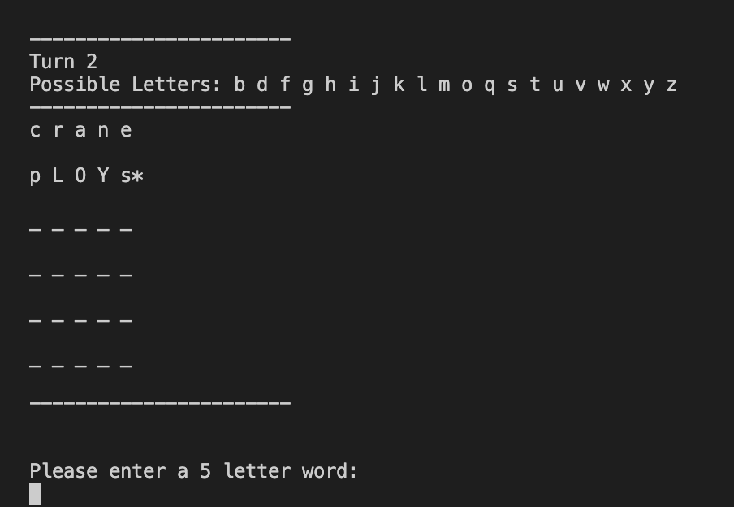
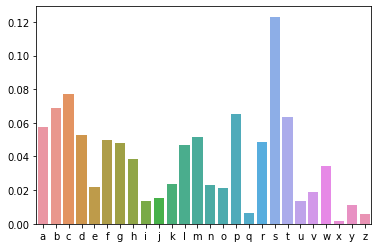
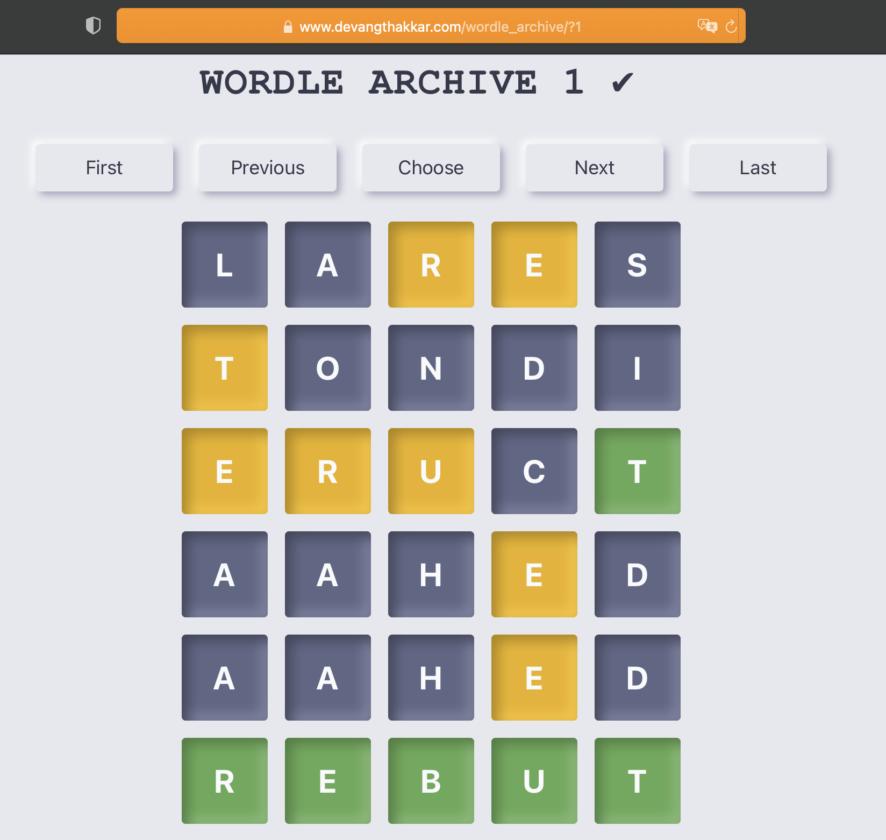
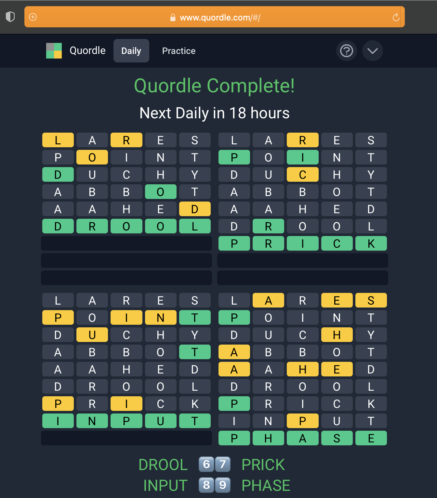
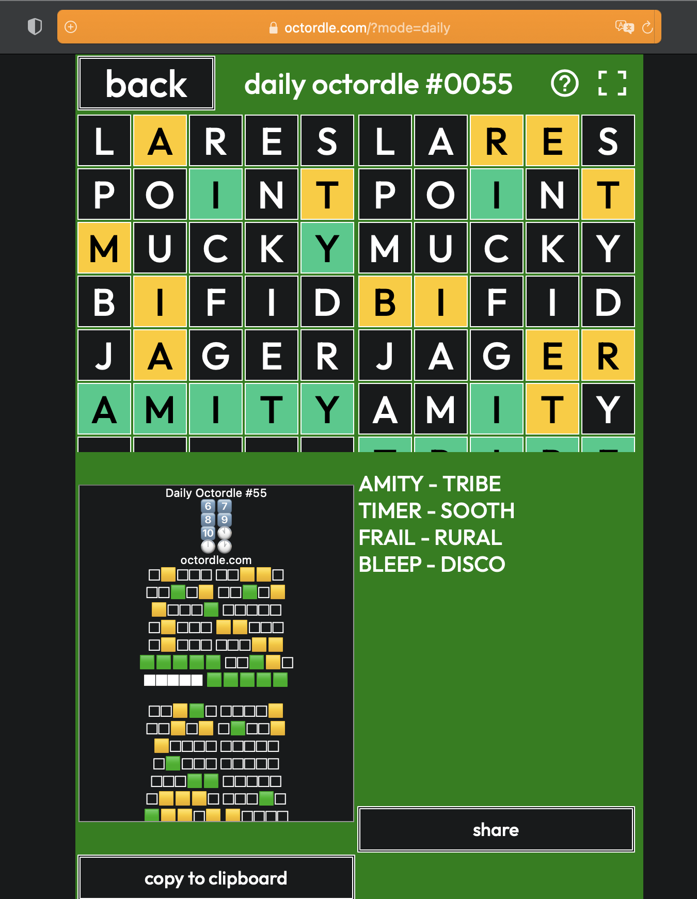

```{r setup, include=FALSE}
library(knitr)
knitr::opts_chunk$set(echo = FALSE)
```

Associated Links:

- [GitHub Repo](https://github.com/NuoWenLei/Wordle_Solver)
- [Wordle](https://www.nytimes.com/games/wordle/index.html)
- [Wordle Archive](https://www.devangthakkar.com/wordle_archive/)
- [Quordle](https://www.quordle.com/#/)

This is a fun project I played around with over my senior year spring break. As the New York Times Wordle game took my school by storm, its simple format made me curious about the possibility of creating an algorithm to solve it. To start the project, I knew that I had to first create some interface for a machine to play Wordle, so, as pastime on a flight, I made a text version of Wordle. There is a small difference however. While the actual Wordle often displays words that are well-known to people, I made my Wordle simply randomly choose a word out of all possible 5-letter words.

```{r, fig.cap = "Text Version of Wordle"}

```

In the text version, capitalize means the letter is in the right place, "*" means the letter is present but in the wrong location, and lower case means the letter is not in the word. I also added a "Possible Letters" bar for ease of playing.

After creating the Wordle game, I began to think about how I would approach creating a Wordle solver. Part of me wanted to create a Reinforcement Learning agent to play the game, but another part of me felt that I've been doing too much AI-related projects recently. I settled on creating a non-AI algorithm that would probabilistically choose the optimal words.

```{r, fig.cap = "Exploration of letter-location probability at the first position of a word"}

```

I first made an algorithm that assigned information "rewards" to getting a letter correct (3 points), present (2 points), or wrong (1 point), thereby generating an information reward value for each word in the vocabulary. It then simply chose the word with the highest information reward. This algorithm created a machine that prioritized letters with a high probability of being in that position above all else. And while it did work to an extent, it was more of a Wordle "attempter" than a Wordle "solver".

Now if I really wanted to spin this into a story about personal insights and biases, this would be the moral of the story. I assumed that a letter in the correct place would always provide more information than other results, and in doing so I created an algorithm whose goal deviated from the overarching goal.

Therefore, to improve the machine, firstly I changed the information reward as dependent on what percentage of the vocabulary the action would eliminate. For example, if getting the word correct eliminates half the vocab, its reward for being correct was 1/2. This is somewhat of a greedy solution because by evaluating the effect of each letter individually, I ignore the percentage of vocabulary that would be eliminated by the outcomes of 2 or more letters in the word. This overlap-elimination effect, however, is minimal, so I chose to ignore the flaw.

Secondly, I added a bunch of conditionals to make sure that no information was wasted. I found that covering all the scenarios where a letter that's present but in the wrong position was quite challenging. But one-by-one I found and covered all those edge cases. Finally, I set the machine to use the first 5 guesses to eliminate as much of the vocabulary as possible and then use the most possible word only for the final guess. This allowed the algorithm to truly "solve" Wordle.

I then created a web interface for the machine to actually play the official Wordle. Using the Python module of Selenium, the Wordle solver (named Trish) could solve the Wordle live in front of your eyes!

```{r, fig.cap = "Trish solving Wordle for March 20, 2022"}
knitr::include_graphics("static/pictures/official_wordle_solve.png")
```

It can also solve any Wordle archived [here](https://www.devangthakkar.com/wordle_archive/).

```{r, fig.cap = "Trish solving Wordle for March 20, 2022"}

```

As a final challenge, I created a separate algorithm that solved [Quordle](https://www.quordle.com/#/) instead of Wordle (named Trisha) by simply adding up the information reward value that could be gained from every board and left the last 4 guesses for optimal words. And, well, as of now (March 20, 2022), it hasn't failed yet!

```{r, fig.cap = "Trisha solving Quordle for March 20, 2022"}

```

Did I say final challenge? I lied. A good friend told me that an Octordle exists, so I had to try it out. The previous algorithm actually FAILED on its first attempt to solve the daily, and I realized it was because the model didn't prioritize game boards with more vocabulary to filter. Therefore, I added a scaling component that multiplies with the information reward based on the number of vocabulary for each game board. This changes the reward gotten from each game board, allowing the solver (now named Patricia) to have a sense of priority or urgency.

```{r, fig.cap = "Patricia solving Octordle for March 20, 2022"}

```

This just started off as a fun project for over spring break. However, it not only helped me brush up on actual hand-coding, but it also taught me some good lessons about probabilities and my own assumptions!


